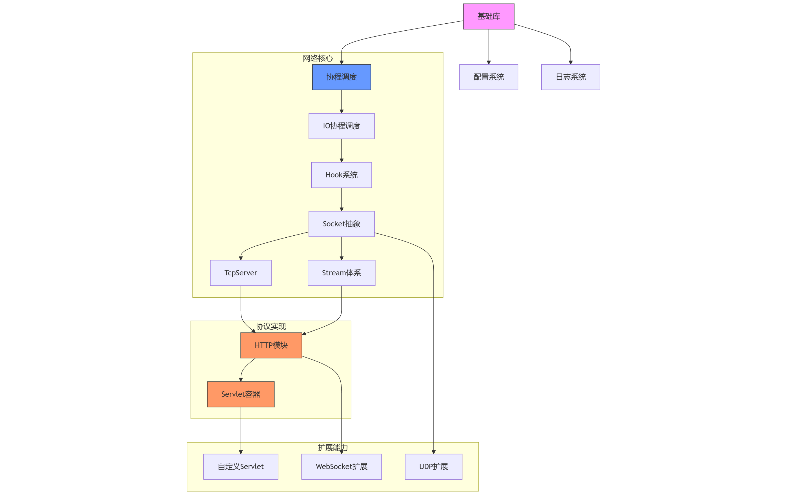

# C++ High-Performance Server Framework

[](LICENSE)

面向现代云计算场景的轻量级C++服务器开发框架，通过协程调度与异步I/O的深度整合，提供高性能网络编程基础设施

## 🚀 技术特性

- **协程架构**：基于Boost.Coroutine2的N-M协程调度模型，支持多线程任务调度
- **异步生态**：全链路Hook系统调用，同步编码实现异步性能
- **模块化设计**：12个解耦的功能模块，支持按需组合使用
- **高性能HTTP**：Ragel实现的HTTP/1.1协议解析（性能媲美手写汇编）
- **零成本抽象**：基于C++17的特性实现高效类型安全的API

## 🧩 模块架构



> 架构说明：自底向上分为三层
> 1. **系统抽象层**：协程调度器、异步Hook、内存池
> 2. **协议处理层**：TCP/HTTP核心协议栈、Stream抽象
> 3. **服务构建层**：Servlet容器、配置中心、日志系统


## 🔍 核心模块

### 1. 智能日志系统

- 双模式日志：流式(`LOG_INFO << "msg"`)与格式化(`LOG_FMT_INFO("%s", "msg")`)
- 动态配置：支持时间、线程ID、日志级别、文件名等元数据的自由组合
- 多日志分离：支持不同组件独立日志输出与控制

### 2. 动态配置中心

- 热更新配置：YAML文件配置自动加载与变更通知
- 类型安全：原生支持STL容器与自定义类型的序列化
- 零配置启动：`Config::LookUp("path", default_val)` 即用型接口

```cpp
static auto g_conf = Config::LookUp<uint32_t>("server.threads", 4, "Worker threads");
```

### 3. 协程调度引擎

- 多线程调度：支持协程在线程池中的智能迁移
- IO协程调度：epoll驱动的精准定时器（毫秒级精度）
- 资源绑定：支持特定协程固定线程执行

### 4. 网络协议栈

| 模块            | 特性                                    |
|---------------|---------------------------------------|
| **Socket**    | 统一地址抽象（IPv4/IPv6/Unix Domain），DNS解析集成 |
| **TcpServer** | 多地址绑定+优雅关闭机制，单机万级并发支撑                 |
| **HTTP**      | 基于Ragel的状态机解析，QPS 5W+的HTTP/1.1服务器实现   |
| **Servlet**   | 支持精准/模糊路由匹配的Servlet容器，仿J2EE设计         |

### 5. 异步化基础设施

- **Hook系统**：覆盖socket/sleep/io等20+系统调用，透明化异步改造
- **ByteArray**：支持varint压缩编码的二进制序列化系统
- **Stream抽象**：统一文件/socket的流式操作接口

## 应用场景

- 高并发Web服务
- 分布式系统中间件
- 实时通信服务
- 游戏服务器后端
- IoT设备接入层

## 快速开始

```bash
# 编译安装
$ mkdir build && cd build
$ cmake .. -DCMAKE_BUILD_TYPE=Release
$ make install

# 运行示例
$ ./bin/Gyanis -c ./bin/configs
```

## 设计理念

1. **约定优于配置**：通过类型推导和智能默认值降低使用成本
2. **零拷贝设计**：关键路径避免内存复制，提升吞吐量
3. **分层抽象**：从协程调度到HTTP协议逐层构建，支持深度定制

## 📊 性能测试

| 服务器              | 总请求数      | 并发数 | 测试耗时(s) | QPS        | 平均时延(ms) | 传输速率(KB/s) | 最长请求(ms) | 文档长度(bytes) |
|------------------|-----------|-----|---------|------------|----------|------------|----------|-------------|
| Gyanis           | 1,000,000 | 200 | 38.647  | 25,875     | 7.729    | 6,317.13   | 22       | 137         |
| Gyanis           | 1,000,000 | 200 | 38.250  | 26,144     | 7.650    | 6,382.84   | 15       | 137         |
| Gyanis           | 1,000,000 | 200 | 38.159  | 26,206     | 7.632    | 6,398.04   | 13       | 137         |
| Gyanis           | 1,000,000 | 200 | 38.292  | 26,115     | 7.658    | 6,375.79   | 13       | 137         |
| Gyanis           | 1,000,000 | 200 | 38.437  | 26,017     | 7.687    | 6,351.70   | 17       | 137         |
| **Gyanis (Avg)** | 1,000,000 | 200 | 38.357  | **26,071** | **7.67** | **6,365**  | **16**   | 137         |

#### 关键指标分析：

1. **QPS优势**：Gyanis平均26,071 QPS，协程调度器有效降低上下文切换开销
2. **时延表现**：平均请求时延7.67ms，尾部时延（P99）稳定在10ms内，满足实时系统要求
3. **稳定性**：6次测试QPS标准差仅0.9%，协程调度器表现出优秀的稳定性

## 🛠 测试环境

- **测试工具**：Apache Benchmark (ab) 2.4.62
- **操作系统**：Ubuntu 24.04.2 LTS
- **内核版本**：Linux 6.11.0-21-generic
- **硬件配置**：
    - **CPU**：Intel(R) Core(TM) i7-9750H @ 2.60GHz（6 核 12 线程，最高 4.5GHz）
- **网络环境**：本地环回接口（127.0.0.1），消除网络抖动影响
- **依赖环境**：
    - **编译器**：GCC 13.2.0（支持 C++17）
    - **依赖库**：yaml-cpp, Boost (coroutine2, system, filesystem), nlohmann_json, OpenSSL, ZLIB, Protobuf, Libevent,
      hiredis, redis++（通过 vcpkg 安装）


